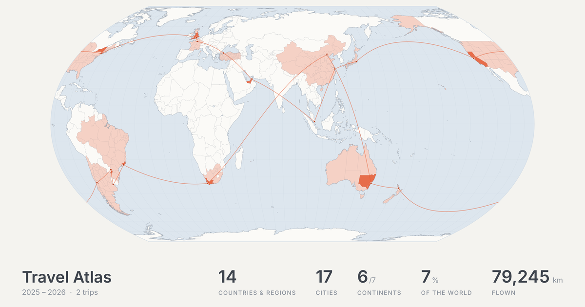

# Travel Atlas

Mark the countries and cities you have been to, keep your trips, and replay your flights on a globe.

**[viiika.github.io/travel](https://viiika.github.io/travel/)**



- A globe and a flat map, with boundaries and names as the United States uses them
- Countries and regions, 1,000 major cities, 44,000 smaller places by search, provinces and states for 26 countries, and places of your own
- Trips with dated stops by plane, train, car or ship, each with a note and photos
- Flight history imported from an English `.xls`, `.xlsx` or `.csv` table; for other languages, such as Umetrip exports in Chinese, the page gives you a prompt to convert the file with an AI assistant
- A year timeline, a flight-route video (MP4 or WebM, up to 4K, with music) and a poster to share
- Zoom out past the Earth to the Moon, Mars and the rest of the solar system

## Your data stays yours

Everything runs in your browser and nothing is uploaded. Your travels are saved to a file of your own (`.json`, or `.zip` once they have photos) that you open again next time. Changes you have not saved are kept in the browser in case the page closes.

## Build

```bash
npm install
npm run build   # writes index.html
```

`npm run fetch-data` and then `npm run data` rebuild the map data in `data/build` from its sources.

## Credits

Map data from [Natural Earth](https://www.naturalearthdata.com/) (public domain), [GeoNames](https://www.geonames.org/) (CC BY 4.0, through `all-the-cities`) and [OurAirports](https://ourairports.com/data/) (public domain). Flags from [country-flag-icons](https://gitlab.com/catamphetamine/country-flag-icons). Built with [d3-geo](https://github.com/d3/d3-geo), [topojson-client](https://github.com/topojson/topojson-client), [fflate](https://github.com/101arrowz/fflate), [mp4-muxer](https://github.com/Vanilagy/mp4-muxer) and [webm-muxer](https://github.com/Vanilagy/webm-muxer); their licenses are at the end of `index.html`.

Pull requests are welcome.

## License

[MIT](LICENSE). Made by [Jinbin Bai](https://github.com/viiika).
